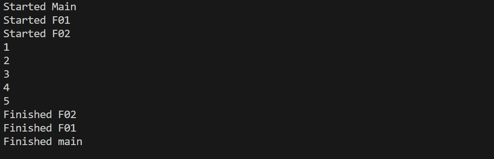

# Curso de Dart

## Lidando com erros e exceções

### Erros X Exceções

As exceções são coisas que sabemos que acontecerão e nos planejamos,  é algo que é excepcional ao modelo padrão do nosso modelo de negócio.

 Os erros são situações que não deveriam ter acontecido e que, muitas vezes, não temos controle sobre elas. Por exemplo, quando você tem que fazer uma operação que é para a Internet e o smartphone não está conectado na Internet. Isso não faz parte do seu modelo de negócios, mas também, se você não estiver preparado para lidar com isso, o seu aplicativo não fica tão amigável, tão funcional.

### Conceito de Pilha de execução

1. Observe o código abaixo:

2. A execução do prints foi assim :

